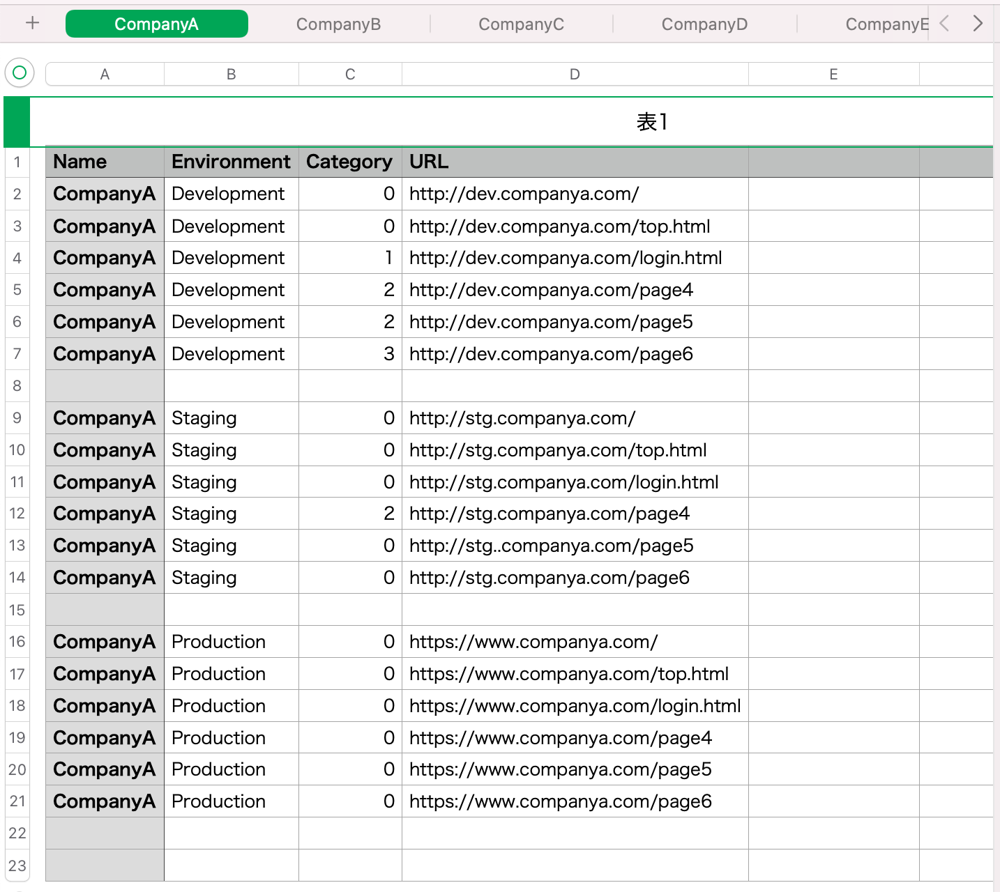
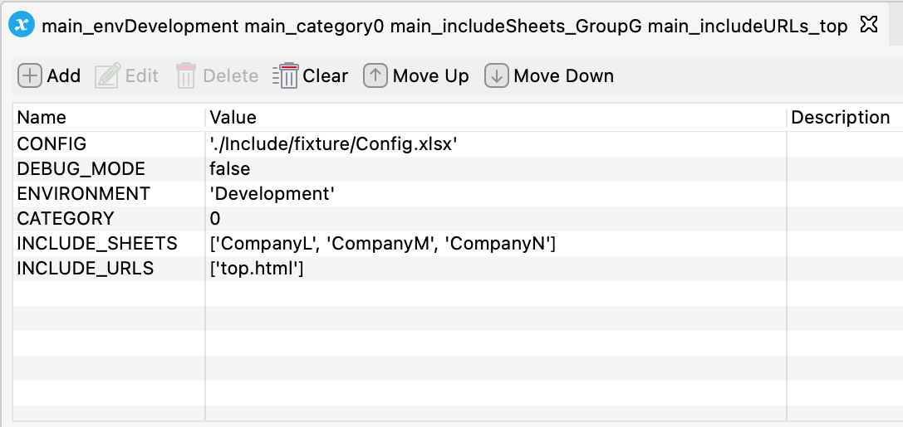
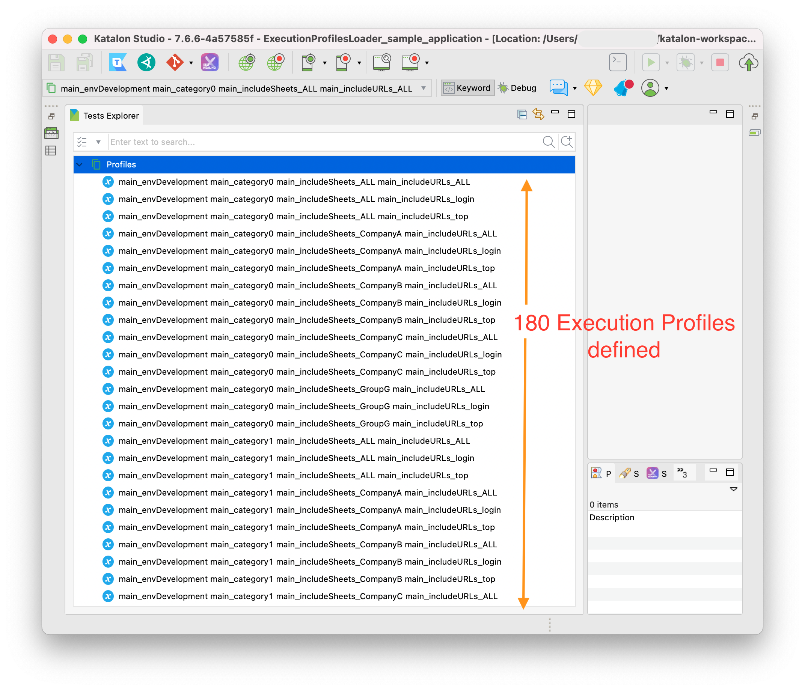
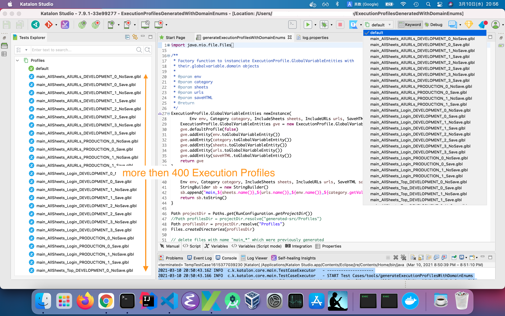

Execution Profiles generated with Domain Enums
======================

<p>@date Mar 2021</p>
<p>@author kazurayam</p>

# Overview of this project

This is a [Katalon Studio](https://www.katalon.com/katalon-studio/) project for demonstration purpose. You can download this to your PC and run it with your Katalon Studio.

This project was developed using Katalon Studio v7.9.1. It should work on every version above v7.0.

In this README, I will explain a problem I got a year ago, and how I recently resolved it.

# Problem to solve

I have developed and published a tool named [VisualTestingInKatalonStudio](https://forum.katalon.com/t/visual-testingg-in-katalon-studio/13361) project on top of [Katalon Studio](https://www.katalon.com/katalon-studio/), which enables me to take screenshots of Web services on browser and to compare the images between environments (e.g. Development and Production) or between 2 different timings (e.g. before and after work of system changes).

Last year (2020) I worked for an [Application Service Provider (ASP)](https://en.wikipedia.org/wiki/Application_service_provider) in Financial industry. They had approximately 40 customers, they provided many URLs to customers: 50 URL as average per a single customer. They maintained 3 environments (Development, Staging, Production) for every customers. This resulted 40 * 50 * 3 = 6000 URL for developers to test frequently to ensure the service quality.

A diligent staff in charge of the Web service mainteined a large Excel file which contained 40 sheets where the urls for each customers were listed. The following picture shows how it looked like:



I developed a Katalon Studio project which works on top of the Visual Testing framework supplied with the Excel file. I wanted to perform *visual testing* over the mass of URLs.

However, a problem arose. The Visual Testing tool takes approximately 10 seconds per a single URL to test. So if I ran the tool against all 6000 URL as a batch, it would take me 6000 * 10 seconds = over 17 hours. Obviously it's too long to repeat frequently.

Therefore I wanted to select smaller number of URLs by some criteria out of the Excel file to make the test run in a shorter time period. If I choose 60 URLs, then the tool will run in 600 seconds = 10 minutes. That's OK. 10 minutes break of work for tea will be welcomed.

Also I wanted the tool to be flexible enough. For example, yesterday, I tested the production URLs for CompanyA; today, I want to test the development URLs for CommpanyB; tomorrow, I would want to test the staging URLs for CompanyL + CompanyM + CompanyN; next week, I will test the production URLs which ends with a string `login.html` of all 40 customers; etc.

I tried to find a solution, and decided to introduce a set of **GlobalVariables** to the testing project which would express URL selection criteria. I enumerated 5 GlobalVariables, each of which may take a range of possible values as follows:

|No.| GlobalVariable name | possible values |
|---|---|---|
|1| `CONFIG` | `'./Include/fixture/Config.xlsx'` |
|2| `ENVIRONMENT` | <ul><li>`Development`</li><li>`Production`</li><li>`Staging`</li></ul>|
|3| `CATEGORY` | <ul><li>0</li><li>1</li><li>2</li><li>3</li><li>4</li></ul> |
|4| `INCLUDE_SHEETS` | <ul><li>`[]`</li><li>`['CompanyA']`</li><li>`['CompanyB']`</li><li>`['CompanyC']`</li><li>`['CompanyL', 'CompanyM', 'CompanyN']`</li></ul><span>in fact the value range is wider ... say 40<span> |
|5| `INCLUDE_URLs` | <ul><li>`[]`</li><li>`['login.html']`</li><li>`['top.html']`</li></ul> |

OK. I can restate my problem to solve. **How can I specify a particular set of values for these 5 GlobalVariables when I execute my test in Katalon Studio?**

Katalon Studio provides a feature named [*Execution Profile*](https://docs.katalon.com/katalon-studio/docs/execution-profile-v54.html). In an Exceution Profile, you can define a set of name=value pairs of GlobalVariables. You can prepare as many Execution Profiles as you want using Katalon Studio GUI. So I createded bunch of Profiles, each of which contains 5 GlobalVariables with values assigned. The following screenshot shows an example:



Now you should remember, **Katalon Studio allows you to appoint only a single Execution Profile for a test execution.**

I realized a difficulty. I had a lot of possible selection criterias: 1 CONFIG * 3 ENVIRONMENTS * 5 CATEGORIES * 6 INCLUDE_SHEETS * 3 INCLUDE_URLs = 180. Therefore I had to prepare 180 Execution Profiles in Katalon Studio GUI. It was a crasy job. The following screenshot shows how the project looked like:



Further more, the range of `GlobalVariable.INCLUDE_SHEETS' values was initially 4, but it could possibly increase to 40. In that case, should I prepare 1800 Profiles maually? No way!

I found a fundamental design problem in Katalon Studio here. This issue has remained unresolved for me since May 2020.

# Solution

In the `Keywords` directory, I will write a few Groovy enums which declares GlobalVariables with enumeration of possible values. I will call them as **Domain Enums**.

Also I will write a Groovy script (actually a Test Case script) which generates hundreds of `*.glbl` files derived from the comibination of the Domain Enums. All of `*.glbl` files are in a valid XML format as a serialized Execution Profile of Katalon Studio.

I will put the generated `*.glbl` files into the `Profiles` folder of a Katalon Studio project. Consequently I will obtain some hundreds of Excecution Profiles ready to use.

With this facilities provided, I do not have to manually create hundreds of Execution Profiles any longer. The tool scripts will smoothly generate them for me.

# Solution Description

## Domain Enums

The following Groovy code reporesents the  GlobalVariables and their possible values:

- [their.globalvariable.domain.Category](Keywords/their/globalvariable/domain/Category.groovy)
- [their.globalvariable.domain.Env](Keywords/their/globalvariable/domain/Env.groovy)
- [their.globalvariable.domain.IncludeSheets](Keywords/their/globalvariable/domain/IncludeSheets.groovy)
- [their.globalvariable.domain.IncludeURLs](Keywords/their/globalvariable/domain/IncludeURLs.groovy)
- [their.globalvariable.domain.SaveHTML](Keywords/their/globalvariable/domain/SaveHTML.groovy)

## Execution Profiles Generator tool

The following is the groovy script that generates a bunch of Execution Profiles. The script enumerates the combinations of possilbe values of the Domain Enums.

- [Test Cases/tools/generateExecutionProfilesWithDomainEnums](Scripts/tools/generateExecutionProfilesWithDomainEnums/Script1615366743011.groovy)

When I execute it, I got the following output in the console:

```
2021-03-10 20:50:43.162 INFO  c.k.katalon.core.main.TestCaseExecutor   - --------------------
2021-03-10 20:50:43.166 INFO  c.k.katalon.core.main.TestCaseExecutor   - START Test Cases/tools/generateExecutionProfilesWithDomainEnums
/Users/username/ExecutionProfilesGeneratedWithDomainEnums/Profiles/main_AllSheets_AllURLs_DEVELOPMENT_0_Save.glbl
/Users/ExecutionProfilesGeneratedWithDomainEnums/Profiles/main_AllSheets_AllURLs_DEVELOPMENT_0_NoSave.glbl
/Users/ExecutionProfilesGeneratedWithDomainEnums/Profiles/main_AllSheets_Login_DEVELOPMENT_0_Save.glbl

... <over 400 lines>

/Users/ExecutionProfilesGeneratedWithDomainEnums/Profiles/main_CompanyC_Login_STAGING_3_NoSave.glbl
/Users/ExecutionProfilesGeneratedWithDomainEnums/Profiles/main_CompanyC_Top_STAGING_3_Save.glbl
/Users/ExecutionProfilesGeneratedWithDomainEnums/Profiles/main_CompanyC_Top_STAGING_3_NoSave.glbl
/Users/ExecutionProfilesGeneratedWithDomainEnums/Profiles/main_GroupG_AllURLs_STAGING_3_Save.glbl
/Users/ExecutionProfilesGeneratedWithDomainEnums/Profiles/main_GroupG_AllURLs_STAGING_3_NoSave.glbl
/Users/ExecutionProfilesGeneratedWithDomainEnums/Profiles/main_GroupG_Login_STAGING_3_Save.glbl
/Users/ExecutionProfilesGeneratedWithDomainEnums/Profiles/main_GroupG_Login_STAGING_3_NoSave.glbl
/Users/ExecutionProfilesGeneratedWithDomainEnums/Profiles/main_GroupG_Top_STAGING_3_Save.glbl
/Users/ExecutionProfilesGeneratedWithDomainEnums/Profiles/main_GroupG_Top_STAGING_3_NoSave.glbl
2021-03-10 20:51:03.394 INFO  c.k.katalon.core.main.TestCaseExecutor   - END Test Cases/tools/generateExecutionProfilesWithDomainEnums
```

The Katalon Studio GUI showed some hundreds of Execution Profiles were generated and are ready for use.



## Benefit

The changes in Domain Enums was really problematic. For example, when we need to support 2 more `INCLUDE_SHEETS` values, so that I need to create 120 Execution Profiles, how much volume of works involved?

If I were manually creating Execution Profiles, I will just exclaim No, I can't do it!

But once I am provided with the tool, I will just do 2 things.
1. modify a Domain Enum [IncludeSheets](Keywords/their/globalvariable/domain/IncludeSheets.groovy) slightly; add 2 enums.
2. kick the [Test Cases/tools/generateExecutionProfilesWithDomainEnums](Scripts/tools/generateExecutionProfilesWithDomainEnums/Script1615366743011.groovy)


Wait for a second, stop KS and restart it. Then the complete set of Executiion Profiles will be ready for use. No hussle will be involved.

## How to reuse this solution in your Katalon Project

The idea of *Domain Enums* and generating `Profiles/*.glbl` files by script is essential and can be reused. The codes in this project are small. A seasoned Groovy programmer would be able to read them through and mimic as needed.
